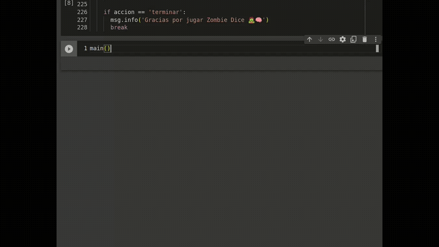

# Cuauhtémoc Bautista - Portfolio Data Scientist
En este portafolio estaré subiendo algunos proyectos relevantes que puedan ayudar a los reclutadores a conocer mis hablidades para el procesamiento, análisis y modelación de datos, big data y machine learning.

El repositorio contiene los siguientes proyectos:
- **Precipitación-Australia:** Proyecto Data Science para el determinar si lloverá o no mediante el análisis de datos climatológicos de Australia, y generadon diversos modelos de clasificación con: Logistic Regression, XGBoost, Naive Bayes, KNeighborsClassifier.
- **Zombie Dice:** Muestro mis habilidades de programación orientada a objetos, con el uso de funciones, clases y métodos para crear un juego de mesa basado en el popular juego de dados Zombie Dice.

- **Curso Python básico:** Es el material que desarrollé para impartir cursos de python básico. Lo desarrollé pensando en personas que nunca han programado, con muchos ejercicios para que practiquen y con material resumido para no saturarlos con información.
- **ETL Flow:** Es un breve ETL, donde creo una base de datos usando postgres mediante comandos de **linux**, 
para después automatizar un proceso de [1] extracción de datos mediante la conexión a una **API**, depués una serie de [2] transformaciones con el uso de pandas y finalmente [3] guardar la información en la base de datos. Finalmente realizo algunos conteos agrupados con pandas.

- **Apuntes modelos de machine learning:** Son notebooks que he desarrollado a modo de apuntes para estudiar el código y los algoritmos.
